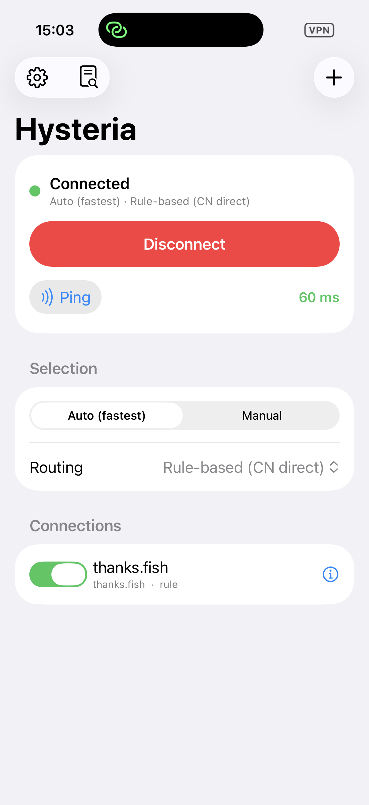
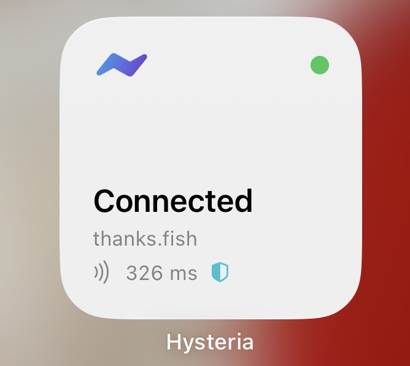

# hy2client — Hysteria 2 managers for macOS & iOS

  
  &nbsp;&nbsp;
  

## Quick start

- **macOS** → `brew install hysteria`, open `HysteriaManager/HysteriaManager.xcodeproj`,
  ⌘R (or run `HysteriaManager/build-release.sh` to install into /Applications).
  See [`HysteriaManager/README.md`](HysteriaManager/README.md).
- **iOS** → build the engine (`HysteriaManagerMobile/Frameworks/build-libbox.sh`), open
  `HysteriaManagerMobile/HysteriaManagerMobile.xcodeproj`, set your Team on all targets,
  run on a device. See [`HysteriaManagerMobile/README.md`](HysteriaManagerMobile/README.md).
